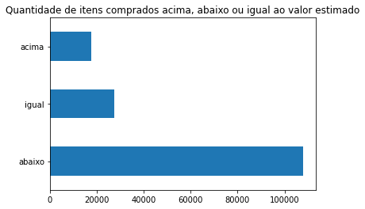
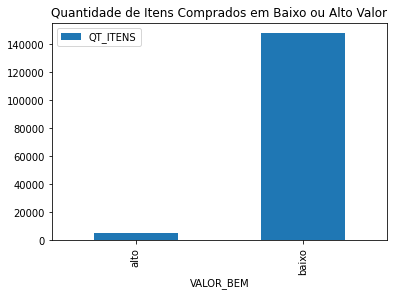
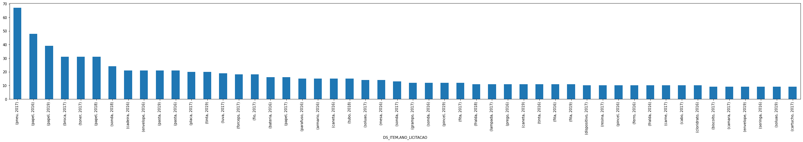
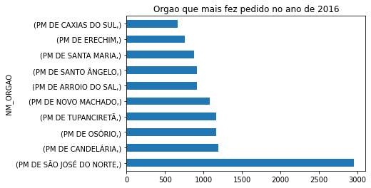
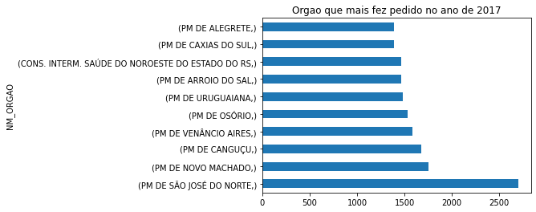
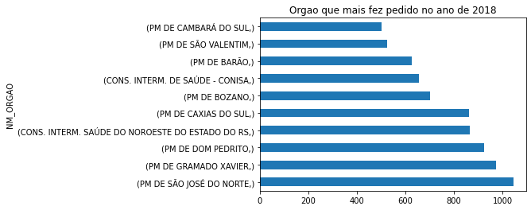
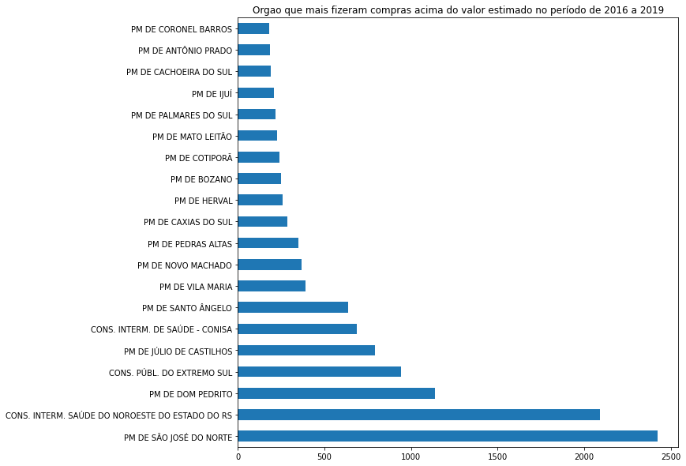

# ANÁLISE DE DADOS UTILIZANDO OS DADOS DO TCE-RS 
## INDRODUÇÃO
Os datasets a serem utilizados neste projeto foram retirados do [portal dados abertos](http://dados.tce.rs.gov.br/dataset?groups=licitacoes&q=consolidado) além da consulta do [manual](https://portalnovo.tce.rs.gov.br/repo/cex/licitacon/eValidador-licitacon-manual-layout-1.4.pdf), onde procurei responder as perguntas pedidas no teste bem como extrair outras informações a serem importantes.

## ETAPAS QUE FORAM REALIZADAS DURANTE O PROJETO
1. Como relatado, os dados foram extraídos do [portal dados abertos](http://dados.tce.rs.gov.br/dataset?groups=licitacoes&q=consolidado)
2. Logo após, foi feito um filtro utilizando a coluna TP_OBJETO='COM', ou seja, foi filtrado tudo que do tipo compras e em seguida, foi realizado o merge entre as duas tabelas já concatenadas pelos anos, foram elas, licitacoes.csv e itens.csv (seguindo o [manual](https://portalnovo.tce.rs.gov.br/repo/cex/licitacon/eValidador-licitacon-manual-layout-1.4.pdf) disponibilizado)
3. Um outro filtro também foi feito, porém dessa vez com palavras como serviço|servidores|contrato|contratação|anexo|locação|tabela|storage all|constituído deconforme|aquisição|edital tudo que poderia ser ser considerado um contrato de um serviço que não é considerado um bem material. Logo, todos os dados que possuem as palavras já mencionadas, foram excluídos do dataset. 
4. Números, pontuações, acentos, e stopwords foram removidos, e depois convertidos em letras minúsculas
5. Também foi realizado um processo para deixar apenas a primeira palavra, por exemplo

| DS_ITEM | DS_ITEM|
| ------------- |:-------------:|
| pneu de carro  |pneu     |
| biscoito doce   | biscoito|
| biscoit salgado | biscoito|  

6. Dados que possuíam valores vazios foram excluídos
7. Após isso, uma análise descritiva da estatistica foi feita para poder ver inicialmente ver a presença de outliers, com isso, é possível ver que havia a presença de valores negativos paara a coluna VL_UNITARIO_HOMOLOGADO e igual a zero para a coluna VL_UNITARIO_ESTIMADO com isso, foram considerados apenas os itens que possuiam valores acima de 0, para as respectivas tabelas
8. Duas colunas foram criadas para poder analisar melhor este dataset, a primeira coluna foi a VALOR_BEM que vai rotular os dados como alto, baixo ou médio. O valor foi a ser considerado foi baseado na média. a segunda coluna criada foi, conhecer quais/quantos itens foram comprados acima do valor estimado
```
 def valorBem(registro):
  if registro['VL_UNITARIO_HOMOLOGADO'] < 8.461925e+02:
    return 'baixo'
  elif registro['VL_UNITARIO_HOMOLOGADO'] == 8.461925e+02:
    return 'medio'
  elif registro['VL_UNITARIO_HOMOLOGADO'] > 8.461925e+02:
    return 'alto'
df['VALOR_BEM'] = df.apply(valorBem, axis=1)

def situacao_homologado(registro):
    if registro['VL_UNITARIO_HOMOLOGADO'] > registro['VL_UNITARIO_ESTIMADO']:#ACIMA DO VALOR ESTIMADO?
        return 'acima'
    elif registro['VL_UNITARIO_HOMOLOGADO'] < registro['VL_UNITARIO_ESTIMADO']:#ABAIXO DO VALOR ESTIMADO?
        return 'abaixo'
    else:
      return 'igual'#IGUAL AO VALOR ESTIMADO
df['SITUACAO'] = df.apply(situacao_homologado, axis=1)
```
# Perguntas a serem respondidas
---
1. Quais itens foram comprados **acima** do valor estimado


|DS_ITEM  |	QT_ITENS    |   VL_UNITARIO_HOMOLOGADO| VL_UNITARIO_ESTIMADO|SITUACAO|
| ------------- |:-------------:|:-------------:| ------------- |:-------------:|
|leite          |	1800.00 |	2.99	|  2.49	|   acima|
|vassaoura      |	10.00   |	7.87	|  7.86	|   acima|
|copo           |	4.00    |	96.00	|  95.50	|acima|
|palha          |	20.00   |	31.00	|  30.00	|acima|

2. Quais itens foram comprados **abaixo** do valor estimado?

|DS_ITEM  |	QT_ITENS    |   VL_UNITARIO_HOMOLOGADO| VL_UNITARIO_ESTIMADO|SITUACAO|
| ------------- |:-------------:|:-------------:| ------------- |:-------------:|
|cebola	|   1200.00|	3.49|	3.50|	abaixo|
|cenoura|	200.00|	    2.85|	2.89|	abaixo|
|laranja|	400.00|	    1.75|	1.79|	abaixo|
|macarro|	40.00|	    3.49|	4.00|	abaixo|
	
3. Quantos itens foram comprados acima, abaixo ou igual ao valor estimado?



4. Quantos itens foram comprados com valor baixo e alto



5. **Quais são os principais bens materiais comprados pelos órgãos públicos do Rio Grande do Sul?**


6. **É possível identificar algum padrão nas compras? Seja por época do ano ou por tipo de órgão comprador?**



7. Em qual ano houve mais licitação?


8. Orgao que mais fez pedido no ano de 2016



9. Orgao que mais fez pedido no ano de 2017



10. Orgao que mais fez pedido no ano de 2018



11. Orgao que mais fez pedido no ano de 2019


12.Quais os 10 primeiros orgaos que fizeram compras de materiais acima do valor estimado no período de 2016 a 2019


